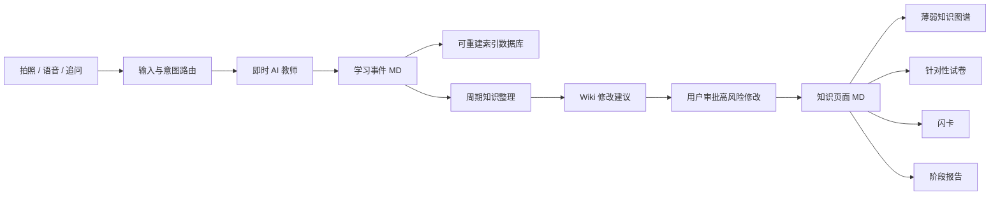

# FocusLens V2 AI 学习知识链路设计

## 1. 目标

FocusLens 的 AI 链路从“每次解题直接生成错题与知识点”升级为两层知识系统：

- **学习事件 Markdown**：记录每次拍题、语音提问、追问、答案查看和人工修正，是不可丢失的事实来源。
- **知识页面 Markdown**：由多个学习事件整理出的稳定知识内容，包含双链、统计、状态和复习材料。

Markdown 是长期真实数据源。SQLite/PostgreSQL 仅承担搜索、统计、图谱和任务索引，可从 Markdown 重建。

## 2. 核心原则

1. 每次互动先成为学习事件，不直接制造知识点。
2. 追问更新当前学习事件，不创建重复错题或重复知识点。
3. 即时回答与后台整理分离：先快速帮助孩子，再异步分类、保存和建立索引。
4. AI 负责建议，用户控制高风险修改和知识点掌握状态。
5. 学习事件中的原始输入不可覆盖；追问、回答、人工修正和状态变化只能追加并留下修订记录。
6. 最终答案默认隐藏，孩子点击后显示，并记录查看时间。
7. 照片保存为压缩后的 WebP 文件，Markdown 仅保存相对路径。

## 3. 总体架构



## 4. Ingest 学习链路

### 4.1 拍照加语音提问

流程：

1. 生成事件 ID，并立即创建 `draft` 学习事件。
2. 保存压缩题目截图。
3. 保存孩子语音原文和可选音频文件。
4. AI 根据截图、题号提示和语音问题识别题干。
5. AI 流式返回解题思路，并持续追加到草稿事件。
6. 最终答案单独保存，前端默认隐藏。
7. 完成事件并标记为 `complete`。
8. 回答完成后异步执行学科分类、事件分类、知识点候选提取和索引更新。

即时回答不得等待 Wiki 重建、图谱更新或周期整理完成。

### 4.2 直接语音知识问答

适用于“这个单词怎么拼”“这个概念是什么意思”等简单问题。

流程：

1. 不拍照，直接录音并识别问题。
2. `TutorVoice` 返回短而直接的回答。
3. 保存为 `question` 学习事件。
4. 不立即创建知识页面。
5. 重复出现、用户主动沉淀或周期整理发现其重要时，提出创建知识页面建议。

### 4.3 上下文追问

追问默认关联当前正在讲解的事件，用户可以手动切换关联对象。

发送给模型的上下文包括：

- 原始题目截图与题干
- 初次问题与解题思路
- 历次追问与回答
- 隐藏最终答案
- 最终答案是否已查看

追问结果追加到原事件 Markdown 的对话记录中，不新增学习事件，不单独创建知识点。

### 4.4 事件生命周期

事件使用以下写入状态：

- `draft`：已记录原始输入，AI 回答尚未完成。
- `complete`：即时回答完成，事件可用于整理。
- `pending_save`：回答已展示，但文件写入或索引更新失败，等待自动重试。
- `archived`：用户归档，不参与默认整理，但仍可查阅。

原始截图路径、原始语音文本和首次提问时间写入后不可被 AI 覆盖。人工修正使用独立的 `corrections` 记录；前端默认显示修正后的内容，同时允许查看原始值。

## 5. 学习事件数据模型

事件类型由 AI 建议，用户可修正：

- `wrong`：存在错误作答
- `stuck`：不会或无法继续
- `question`：普通知识咨询
- `review`：主动复习

分类置信度较低时标记为待确认。

示例：

```markdown
---
id: event_20260607_xxxx
type: wrong
classification_confidence: 0.86
subject: 数学
chapter: 数与运算
created_at: 2026-06-07T20:30:00+08:00
updated_at: 2026-06-07T20:36:00+08:00
write_status: complete
question_image: ../../assets/questions/2026/06/event_xxxx.webp
knowledge_suggestions:
  - 分数裂项
  - 相邻项相消
answer_revealed: false
answer_revealed_at:
related_knowledge: []
corrections: []
---

# 第 33 题学习记录

## 题干

题干正文。

## 学生原始问题

第 33 题怎么做？

## 解题思路

默认展示的启发式解题步骤。

## 最终答案

前端默认隐藏，点击“查看最终答案”后显示。

## 对话记录

### 追问 1

- 学生：为什么这里要裂项？
- AI：因为裂项后相邻项可以抵消。

## AI 分类建议

- 类型：做错
- 错因：未识别裂项后的相消关系
```

## 6. 知识页面与掌握状态

知识页面由多个学习事件整理形成，而不是由单次提问直接创建。

知识状态完全由用户手动修改：

- `weak`：薄弱
- `learning`：学习中
- `mastered`：已掌握
- `ignored`：暂时忽略

AI 可以提供状态建议和证据，但不得自动修改状态。“已掌握”和“暂时忽略”默认排除在出题与闪卡范围外。再次发生相关提问或错误时，仅提示用户重新评估状态。

示例：

```markdown
---
id: knowledge_math_fraction_telescoping
subject: 数学
chapter: 数与运算
status: weak
wrong_count: 3
stuck_count: 1
question_count: 2
first_seen_at: 2026-05-20
last_seen_at: 2026-06-07
---

# 分数裂项相消

## 核心概念

稳定知识说明。

## 常见错因

从来源事件归纳的错因。

## 前置知识

- [[分数通分]]
- [[代数式拆分]]

## 相关知识

- [[数列求和]]

## 来源事件

- [[event_20260607_xxxx]]
```

## 7. 周期知识整理

`WikiCurator` 读取新增学习事件和现有知识页面，检查：

- 重复或近似知识点
- 信息缺失与内容冲突
- 学科和章节归类
- 前置知识与关联知识
- 双向链接缺失
- 重复提问、做错和不会的次数与时间

### 7.1 自动执行的低风险操作

- 更新统计次数和首次、最近发生时间
- 增加来源事件链接
- 建立明确的双向链接
- 补充标签和活动摘要
- 修正 Markdown 格式

### 7.2 必须用户确认的高风险操作

- 合并、拆分或删除知识页面
- 重命名知识点
- 调整学科或章节
- 修改知识点核心结论
- 修改知识状态

整理结果保存为：

```text
wiki/runs/lint_{timestamp}.md
wiki/changes/{timestamp}.json
```

变更文件必须包含操作前后内容、修改原因、引用证据和回退信息。

## 8. 复习材料

### 8.1 针对性试卷

用户按知识状态、学科、章节、难度和题量筛选后生成试卷 Markdown。

试卷包含：

- 出题范围与生成时间
- 来源知识页面与学习事件链接
- 题目
- 默认折叠的答案与解析
- AI 生成提示词

首版不记录学生作答，不自动更新知识状态。

### 8.2 闪卡

适用于单词拼写、公式、定义、易错规则和判断条件。闪卡保存为 Markdown，并记录来源知识点和事件。

删除闪卡时移入 `wiki/archive/flashcards/`，不物理删除，可恢复。

### 8.3 阶段报告

周度、月度和学期结束时仅提醒用户，由用户点击生成。报告保存为新版本，不覆盖旧报告。

报告包含：

- 提问、做错、不会的次数变化
- 高频重复问题
- 学科与章节分布
- 手动掌握状态变化
- 最终答案查看比例
- 建议复习顺序
- 薄弱知识图谱摘要

## 9. AI 服务边界

| 服务 | 职责 | 延迟目标 |
|---|---|---|
| `TutorVision` | 拍题识别、解题思路和隐藏答案 | 首个有效内容约 2–5 秒 |
| `TutorVoice` | 简单知识问答 | 首个有效内容约 1–3 秒 |
| `TutorFollowUp` | 使用当前事件上下文继续讲解 | 首个有效内容约 1–3 秒 |
| `EventClassifier` | 学科、章节、事件类型和知识候选 | 异步 |
| `WikiCurator` | 检查、补全、双链和修改建议 | 后台慢任务 |
| `ReviewGenerator` | 试卷、闪卡和报告 | 用户主动触发 |

即时回答只依赖 Tutor 服务。分类、Wiki 写入、图谱和报告不得阻塞孩子看到答案。

## 10. 本地文件结构

```text
focuslens-api/wiki/
├── events/
│   └── 2026/06/event_xxxx.md
├── assets/
│   └── questions/2026/06/event_xxxx.webp
├── knowledge/
│   └── 数学/数与运算/分数裂项相消.md
├── papers/
│   └── paper_20260607_fraction_review.md
├── flashcards/
│   └── english_spelling_20260607.md
├── reports/
│   ├── weekly/
│   ├── monthly/
│   └── semester/
├── runs/
│   └── lint_20260607_203000.md
├── changes/
│   └── 20260607_203000.json
└── archive/
    └── flashcards/
```

## 11. 索引数据库

索引数据库负责：

- 全文搜索
- 页面列表
- 统计聚合
- 知识图谱节点和边
- 后台任务状态
- 修改建议审批状态

索引数据库不是事实来源。系统必须提供“从 Markdown 重建索引”能力，重建过程不得修改 Markdown。

## 12. 错误处理与一致性

1. AI 回答成功但后台保存失败时，前端保留回答并显示“待保存”，后台自动重试。
2. 事件 Markdown 使用临时文件写入后原子替换，避免半文件。
3. 截图保存失败时，事件仍可保存，但标记 `question_image_missing: true`。
4. 追问关联事件不存在时，不创建隐式知识点；提示用户选择事件或转为普通提问。
5. AI 分类失败时保存原始事件，分类字段设为待确认。
6. 高风险 Wiki 修改未经确认不得写入正式知识页面。
7. 每次修改均记录来源、时间和回退信息。

## 13. 验收标准

### Ingest

- 拍题加语音能流式返回解题思路，最终答案默认隐藏。
- 解答完成后生成事件 Markdown 和压缩截图。
- 简单语音问题能快速回答并生成事件 Markdown，但不立即创建知识页面。
- 多次追问追加到同一事件文件，不产生重复知识点。

### 整理

- 周期整理能识别重复知识点并生成合并建议。
- 低风险统计和双链自动更新。
- 高风险修改必须经用户确认。
- 原始事件在整理后保持不变。

### 复习

- 可排除“已掌握”和“暂时忽略”知识点后生成试卷。
- 闪卡可归档和恢复。
- 周度、月度和学期报告由用户点击生成并保留版本。

### 数据可靠性

- 删除索引数据库后，可从 Markdown 完整重建页面、搜索、统计和图谱。
- API Key、数据库、事件、截图和 Wiki 生成文件均不上传 Git。

## 14. 分阶段实施建议

1. **事件存储基础**：定义事件 Markdown、图片压缩、原子写入和索引重建。
2. **三类 Tutor 链路**：拆分拍题、语音和追问；追问更新原事件。
3. **知识页面与人工状态**：事件沉淀建议、知识浏览和状态管理。
4. **Curator 审批链路**：低风险自动写入、高风险建议与回退。
5. **试卷、闪卡和报告**：基于知识页面生成复习材料。
6. **图谱与周期提醒**：展示薄弱全貌并提醒生成周期报告。
