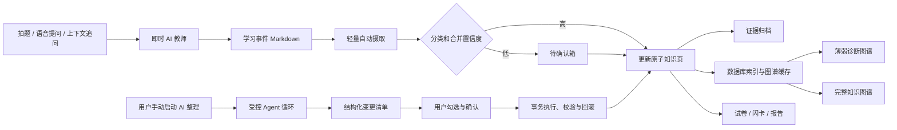
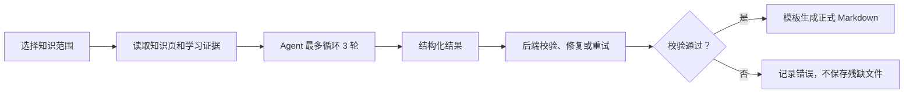

# FocusLens V2 Wiki Agent 知识系统设计

## 1. 目标

FocusLens Wiki 不是把每次 AI 对话直接堆成知识点，而是把学生的提问、错题和追问沉淀为可整理、可验证、可复习、可迁移的本地知识库。

系统需要解决以下核心问题：

- AI 教师回答后可以快速、低干扰地摄取学习证据。
- 追问更新原学习事件，不持续制造重复知识点。
- 数学、英语和未来新增学科能够正确分区，并允许家长修正。
- AI 能够真正整理底层 Wiki，而不只是给出建议文本。
- 薄弱图谱展示学生当前需要关注的知识结构，而不是展示全部原始文本。
- 出题、闪卡和报告必须生成可打开、可复用的正式 Markdown 文件。
- 所有 AI 修改都可审查、可撤销、可重复执行，不破坏家长手工内容。

## 2. 核心原则

1. **学习事件先于知识点**：每次拍题或语音提问先记录为学习事件，再判断是否需要更新知识页。
2. **追问属于同一上下文**：追问追加到当前学习事件，并更新相关知识页；除非明确涉及新的独立概念，否则不创建新知识点。
3. **Markdown 是事实来源**：本地 Markdown 文件是长期可迁移的数据源，能够直接用 Obsidian 等工具打开。
4. **数据库是索引与事务层**：数据库保存搜索索引、图谱缓存、掌握状态、内容哈希、事务、快照和撤销记录，可由 Markdown 重建。
5. **即时答疑与深度整理分离**：AI 教师先快速帮助学生；轻量摄取异步执行；深度整理仅由用户手动启动。
6. **AI 修改受约束**：Agent 只能调用白名单工具，不能直接任意读写文件。
7. **人工内容优先**：家长手工修改、锁定字段和教纲导入内容不能被 AI 自动覆盖。
8. **正式产物必须通过校验**：模型思考过程、JSON 外壳、残缺内容和错误格式不写入正式 Wiki。
9. **弱点必须有证据**：知识状态由有效学习证据和复测结果驱动，不能因为一次提问就永久标记为薄弱。
10. **所有修改可恢复**：执行前创建快照，删除进入回收站，失败整体回滚。

## 3. 总体架构



## 4. 本地 Wiki 文件结构

```text
focuslens-api/wiki/
├─ index.md
├─ inbox/
│  └─ pending_<id>.md
├─ subjects/
│  └─ <subject-id>/
│     ├─ index.md
│     └─ chapters/
│        └─ <chapter-id>.md
├─ knowledge/
│  └─ <subject-id>/
│     └─ <chapter-id>/
│        └─ <knowledge-id>.md
├─ evidence/
│  └─ <yyyy>/
│     └─ <mm>/
│        └─ event_<id>.md
├─ papers/
│  ├─ <paper-id>_paper.md
│  └─ <paper-id>_answers.md
├─ flashcards/
│  └─ <deck-id>.md
├─ reports/
│  └─ <report-id>.md
├─ snapshots/
│  └─ <transaction-id>/
├─ changelog/
│  └─ <transaction-id>.md
└─ trash/
   └─ <deleted-at>_<id>.md
```

文件路径使用稳定 ID，不使用页面标题作为文件名。知识点改名或移动后，内部链接仍通过页面 ID 正确解析。

新学科在 AI 高置信度识别后自动建立目录；置信度不足时进入待确认箱。系统不在正式知识库中创建“未归类章节”作为兜底垃圾桶。

## 5. 数据模型

### 5.1 学习事件

一次拍题或直接语音提问创建一个学习事件。上下文追问追加到同一个事件。

```markdown
---
id: event_20260613_xxxx
type: wrong
subject: 数学
created_at: 2026-06-13T20:30:00+08:00
updated_at: 2026-06-13T20:36:00+08:00
status: archived
knowledge_ids:
  - kp_math_7f31
answer_revealed: false
---

# 第 33 题学习记录

## 原始题目

题干正文。

## 首次提问

学生的语音问题。

## AI 引导与解题步骤

启发式讲解及完整步骤。

## 最终答案

默认折叠展示。

## 追问记录

### 追问 1

- 学生：为什么这里要裂项？
- AI：因为裂项后相邻项可以抵消。
```

规则：

- 学习事件成功摄取后移动到证据归档，不直接显示在图谱和章节树中。
- 删除证据时先移入回收站，并从统计、最近错误和薄弱计算中排除。
- 删除证据不会自动删除知识页；缺少有效证据的知识页标记为“缺少证据”。

### 5.2 原子知识页

一个知识页只描述一个可独立理解和验证的概念。

```markdown
---
id: kp_math_7f31
subject: 数学
chapter: 数与代数
short_title: 分数裂项
full_title: 分数裂项相消求和
status: 薄弱
source: ai
manual_fields:
  - chapter
locked_fields: []
prerequisites:
  - kp_math_fraction_add
related:
  - kp_math_sequence
evidence_count: 3
last_seen_at: 2026-06-13
---

# 分数裂项相消求和

## 核心概念
## 常见错因
## 解题方法
## 前置知识
## 相关知识
## 学习证据
## 掌握验证
```

标题采用双字段：

- `short_title`：图谱、章节树和行动列表使用，建议不超过 10 个中文字符。
- `full_title`：知识页标题、搜索和正式报告使用，保证含义准确。

字段记录来源和保护状态：

- `AI 生成`
- `家长手工修改`
- `已锁定`
- `教纲导入`

Agent 可以对受保护字段提出建议，但不能自动覆盖。

### 5.3 掌握状态

知识掌握使用生命周期，而不是固定百分比：

```text
待验证 → 薄弱 → 学习中 → 待复测 → 已掌握
```

- 单次提问不会自动标记为薄弱。
- AI 完成讲解不会自动标记为已掌握。
- 定向练习和间隔复测结果共同推进状态。
- 家长可以手工覆盖状态。
- 已掌握知识默认从薄弱图谱隐藏，但保留在完整知识图谱。

## 6. 摄取与知识合并

### 6.1 轻量自动摄取

每次 AI 教师回答完成后异步执行：

1. 完成学习事件 Markdown。
2. 判断学科、章节、核心概念、常见错因和前置知识候选。
3. 搜索已有知识页。
4. 高置信度时更新已有知识页或创建新学科、章节和知识页。
5. 低置信度时创建待确认卡片。
6. 成功摄取后将学习事件移动到证据归档。
7. 局部更新数据库索引和图谱缓存。

该流程不得阻塞 AI 教师即时回答。

### 6.2 追问处理

追问默认关联当前学习事件，并更新该事件的追问记录。

只有追问明确涉及另一个独立概念时，系统才可以：

- 关联已有知识页；或
- 创建候选知识点并放入待确认箱。

系统不得因为每次追问都生成新知识点。

### 6.3 自动合并规则

自动合并必须同时满足：

- 学科相同。
- 语义相似度达到高置信度。
- 核心概念和适用范围一致。
- 不与手工字段、锁定字段或教纲定义冲突。

不确定时禁止自动合并，并在待确认箱展示两个候选页面的差异。

## 7. Wiki 页面与交互

Wiki 页面拆成五个独立分页：

1. **薄弱诊断**
2. **知识库**
3. **待确认箱**
4. **AI 整理**
5. **学习材料**

### 7.1 薄弱诊断

默认展示稳定分层图谱：

```text
学科 → 章节 → 薄弱知识点 → 前置知识
```

交互规则：

- 默认隐藏具体错题、学习事件、错因节点和已掌握知识。
- 数学、英语等学科分区显示，不混成一团。
- 支持按学科、时间范围、掌握状态和证据数量筛选。
- 支持稳定分层布局与 Obsidian 风格自由力导向布局切换。
- 节点标签仅显示 `short_title`。
- 节点大小表示有效证据数量；颜色表示掌握状态和薄弱程度。
- 点击节点打开右侧详情抽屉，保留当前缩放、筛选和图谱位置。

右侧抽屉使用行动语言，不使用难懂的“知识点优先级”和“前置缺口”：

- 为什么需要复习
- 最近在哪里出错
- 建议先复习什么
- 下一步行动
- 打开完整知识页
- 修改分类、标题、关系与锁定状态

图谱首版使用成熟的 2D Canvas 力导向组件。Three.js 不作为首版依赖，避免文字可读性和交互维护成本过高。

### 7.2 知识库

采用三段式布局：

```text
可收纳学科章节树 | 宽屏 Markdown 正文 | 按需打开的属性抽屉
```

- 学科章节树支持展开、收纳、滚动、新增、重命名、移动和手工归类。
- 所有学科均显示，新增学科自动加入树。
- Markdown 正文占据主要宽度，支持 LaTeX、双链和内部页面跳转。
- 属性抽屉默认关闭，需要时从右侧打开。
- 相关错题和知识链接打开对应 Wiki 页面，不跳回首页。

### 7.3 待确认箱

低置信度内容以可编辑卡片展示：

- 原始题目
- 学生语音问题
- AI 回答摘要
- 推荐学科和章节
- 知识点短标题与完整标题
- 核心概念
- 常见错因
- 前置知识
- 掌握状态建议

支持：

- 确认摄取
- 修改后摄取
- 暂存
- 合并到已有知识页
- 创建新知识页
- 删除
- 忽略
- 重新运行 AI 判断
- 批量操作
- 锁定单个字段

### 7.4 AI 整理

AI 整理不是建议生成器，而是受控的 Wiki 维护 Agent。

页面展示：

- 本次整理范围
- 可选“本次整理意见”输入框
- 增量整理与全库重新整理入口
- Agent 阶段进度
- 具体变更清单
- 修改前后差异
- 操作原因
- 每项操作的复选框
- 预计费用
- 执行、取消和撤销按钮

用户必须先看到具体变更清单，能够取消勾选任意操作，再执行剩余操作。

“本次整理意见”只影响当前运行，并保存到本次运行日志，不变成永久规则。

### 7.5 学习材料

集中管理正式产物：

- 练习试卷和独立答案解析
- 闪卡组
- 周度、月度和学期报告

支持打开、搜索、删除、重新生成、掌握标记和追溯来源知识点。

## 8. 受控 Agent 循环

### 8.1 执行模式

Agent 使用完整循环，但受工具、轮数和事务限制：

```text
读取范围 → 分析问题 → 制定操作计划 → 调用白名单工具
→ 校验结果 → 必要时修正 → 生成最终变更清单
```

- 单次运行最多循环 3 轮。
- 校验通过后可提前结束。
- 每次运行是独立事务，可以安全重复执行。
- 默认执行增量整理，仅处理新增、修改、待确认和受关联变化影响的内容。
- 提供手动“全库重新整理”入口。
- 通过内容哈希和最后整理版本避免重复创建和重复修改。

### 8.2 Agent 工具白名单

Agent 不直接操作文件系统，只能调用：

- `read_pages`
- `search_pages`
- `propose_create_page`
- `propose_update_fields`
- `propose_merge_pages`
- `propose_move_page`
- `propose_add_links`
- `propose_remove_links`
- `propose_archive_evidence`
- `propose_trash_page`
- `validate_wiki`
- `generate_artifact`

模型输出严格结构化操作计划。后端负责：

- Schema 校验
- 权限校验
- 字段保护
- 依赖关系检查
- 快照
- 执行
- 结果验证
- 失败回滚
- 变更日志

### 8.3 人工内容冲突

遇到手工修改、锁定字段或教纲导入内容时：

- Agent 不得自动覆盖。
- 冲突操作进入待确认清单。
- 用户可以接受 AI 建议、保留人工内容或手工合并。

### 8.4 删除与撤销

- 删除统一移动到 `trash/`。
- 执行前在 `snapshots/<transaction-id>/` 创建快照。
- 执行结果写入 `changelog/<transaction-id>.md`。
- 任一步失败时整体回滚。
- 用户可对已执行事务一键撤销。

## 9. 正式学习材料生成

出题、闪卡和报告使用完整 Agent 循环，但最终文件由后端模板生成。



### 9.1 一键出题

生成两份关联文件：

- `<paper-id>_paper.md`：正式试卷，不直接展示答案。
- `<paper-id>_answers.md`：完整解题步骤、思路、答案和对应知识点。

要求：

- 题目围绕所选薄弱或待复测知识点生成。
- 不简单复制原错题。
- 每道题可追溯到知识点和证据。
- 过滤模型思考过程和英文元说明。

### 9.2 一键闪卡

每张闪卡必须包含：

- 明确的正面问题、概念辨析、公式或记忆提示。
- 准确的背面答案和简短解释。
- 来源知识点和可选来源证据。
- 掌握标记。

禁止生成“回顾相关错因”“先说概念再做题”等空泛占位内容。

### 9.3 一键报告

支持周度、月度和学期报告，必须包含：

- 学习概况和有效证据数量。
- 新增、改善、待验证和已掌握知识点。
- 反复出现且有证据支持的错因。
- 建议复习顺序及理由。
- 下一阶段可执行计划。

## 10. 错误处理

- AI 返回思考过程、JSON 外壳、英文元说明或不符合 Schema 的结果时，自动拒绝并重试。
- 单次 Agent 最多循环三轮；仍失败则显示明确原因，不生成正式文件。
- AI 请求失败不影响现有 Wiki 和 AI 教师即时回答。
- 闪卡、试卷、报告和整理失败时保留诊断日志。
- 内部链接由稳定页面 ID 解析，改名和移动后仍然有效。
- 删除证据后立即局部重算相关知识统计与图谱。
- 执行变更期间任何失败均整体回滚。

## 11. 性能与成本

- 即时 AI 教师回答不等待 Wiki 摄取、图谱更新或深度整理。
- 默认仅增量扫描新增、修改和受影响页面。
- 数据库保存页面内容哈希、最后整理版本和图谱缓存。
- Wiki 变化后局部重建图谱，不默认全量重建。
- 学习事件、具体错题和长文本默认不加载进图谱。
- 长列表使用虚拟滚动。
- AI 整理在后台独立运行，用户仍可浏览 Wiki。
- 全库重新整理必须由用户手动启动，并显示处理范围和预计费用。

## 12. API 与类型边界

建议新增或调整以下后端接口：

```text
GET    /api/wiki/pages
GET    /api/wiki/pages/{pageId}
PATCH  /api/wiki/pages/{pageId}
DELETE /api/wiki/pages/{pageId}

GET    /api/wiki/graph
GET    /api/wiki/inbox
POST   /api/wiki/inbox/{itemId}/confirm
POST   /api/wiki/inbox/{itemId}/rerun
DELETE /api/wiki/inbox/{itemId}

POST   /api/wiki/organize/plan
POST   /api/wiki/organize/execute
POST   /api/wiki/organize/undo
GET    /api/wiki/organize/runs/{runId}

POST   /api/wiki/papers
POST   /api/wiki/flashcards
POST   /api/wiki/reports
GET    /api/wiki/artifacts
```

核心前端类型：

```ts
type WikiPageType =
  | "subject"
  | "chapter"
  | "knowledge"
  | "evidence"
  | "paper"
  | "flashcards"
  | "report";

type MasteryState =
  | "pending_verification"
  | "weak"
  | "learning"
  | "pending_retest"
  | "mastered";

type FieldOrigin = "ai" | "manual" | "locked" | "curriculum";

interface WikiOrganizeOperation {
  id: string;
  type: string;
  risk: "low" | "medium" | "high";
  reason: string;
  before: unknown;
  after: unknown;
  selected: boolean;
  conflicts: string[];
}
```

## 13. 测试与验收

### 13.1 摄取与重复控制

- AI 教师回答后生成学习事件并异步摄取。
- 追问追加到原事件，不重复创建事件或知识点。
- 相同知识点高置信度时正确合并。
- 低置信度分类进入待确认箱。
- 新学科高置信度时自动创建，低置信度时等待确认。

### 13.2 数据保护

- 手工修改、锁定字段和教纲内容不会被 AI 自动覆盖。
- 删除进入回收站。
- 执行失败完整回滚。
- 已执行事务可以撤销。
- 重复执行增量整理不会重复创建页面。

### 13.3 图谱与页面

- 数学、英语及新增学科不会混入同一章节。
- 默认薄弱图谱不展示学习事件和长文本节点。
- 所有节点使用短标题。
- 点击节点打开详情抽屉并保留图谱状态。
- 学科章节树展示所有学科并支持手工归类。
- Markdown 正文宽屏展示，LaTeX 与内部链接可正常打开。

### 13.4 AI 整理

- Agent 最多循环三轮。
- 默认仅扫描增量范围。
- 用户可以输入本次整理意见。
- 执行前展示具体变更清单和差异。
- 用户可以取消勾选任意操作。
- 执行后生成快照、日志并支持撤销。

### 13.5 正式产物

- 出题生成可打开的试卷和独立答案解析 Markdown。
- 闪卡正反面内容具体、准确且可追溯。
- 报告包含有效证据、状态变化和可执行计划。
- `Thinking Process`、JSON 外壳、错误格式和残缺内容不会写入正式文件。
- 生成失败不会污染现有 Wiki。

## 14. 实施边界与分期

该设计覆盖完整 Wiki 目标，但实施必须分阶段完成：

### 阶段 1：事实层与数据安全

- 学习事件、追问归并、证据归档、稳定 ID。
- 原子知识页、待确认箱、字段来源和锁定。
- 回收站、快照、事务和撤销。

### 阶段 2：页面与图谱

- 五分页 Wiki 页面。
- 学科章节树、宽屏 Markdown、属性抽屉。
- 稳定分层薄弱图谱和详情抽屉。

### 阶段 3：受控 Agent 整理

- 增量扫描、三轮循环、结构化变更计划。
- 用户逐项审核、事务执行和回滚。
- 全库重新整理入口。

### 阶段 4：正式学习材料

- 试卷与答案解析。
- 闪卡组。
- 周度、月度和学期报告。

### 阶段 5：完整知识图谱与复测闭环

- Obsidian 风格自由图谱。
- 定向练习、间隔复测和掌握状态推进。
- 教纲融合与覆盖度分析。

## 15. 已确认决策

- 自动轻量摄取，低置信度进入统一待确认箱。
- 深度整理仅手动触发，默认增量整理，可选择全库整理。
- 使用完整 Agent 循环，单次最多三轮。
- Agent 执行前展示具体可取消勾选的变更清单。
- 手工修改、锁定字段和教纲定义受到保护。
- 新学科高置信度时自动创建。
- Markdown 是事实来源，数据库是索引与事务层。
- 薄弱图谱与完整图谱双模式。
- 默认稳定分层图谱，提供自由力导向图谱。
- 追问更新原事件，不自动创建新知识点。
- 学习事件摄取成功后进入证据归档。
- 删除证据后重新计算，但不自动删除知识页。
- 知识页采用短标题与完整标题双字段。
- 图谱节点点击打开右侧详情抽屉。
- 学科章节树、宽屏 Markdown 和按需属性抽屉。
- 出题、闪卡和报告生成正式 Markdown，不保存模型思考过程。
